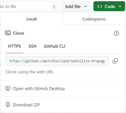

# Satellite Propagation Toolkit

The satellite propagation toolkit is designed to generate 2D projection images and data of trackable objects orbiting Earth using real satellite tracking data from CelesTrak and accurate propagation using the SGP4 model.

The project can generate images based on the tracking data of satellites and satellite tags from the NORAD and SATCAT CelesTrak datasets using either a Topocentric or Geocentric projection above a given location on the Earth's surface.

The project is suitable for everyone from novices with little to no programming experience who want to show what satellites they can see, to experts looking to analyse the satellite orbits, create outreach activities or highlight key space trends.

## Table of Contents

* [Features](#features)
* [Setup](#setup)
* [About the tool](#about-the-tool)
* [Testing](#testing)
* [Generating standalone images](#generating-standalone-images)
* [Outreach recommendations](#outreach-recommendations)
* [Hardware operations](#hardware-operations)
* [Sample analysis](#sample-analysis)
* [Documentation](#documentation)

## Features

The core features of the project are:

* Automatically download, cache and update satellite tracking data and metadata
* Propagating tracked objects using the industry standard SPG4 model
* Generating 2D data frames containing Topocentric or Geocentric projections of tracked objects over a given position.
* Generating images from tracking data based on custom analysis of metadata and satellite tags
* Displaying satellite generated images on [supported devices](#hardware-operations) whilst tethered to a PC or standalone


<!-- Include images of hardware - massive panel -->

This program has been written with extensibility in mind and supports a wide range of customisation without writing any new logic. See [documentation](#documentation) and [quickstart script](quickstart.py) for more details.

## Setup

Instructions for minimal software setup.

See [hardware setup](#hardware-setup) after software setup to set up hardware as well.

### Prerequisites

This project requires that you already have the following software installed on your machine:

* python3.6+
* pip

### Downloading

To download the project, navigate to the top of this page. Press the "Code" button and then "Download ZIP".



Once you've got your zip file, extract it into your new project folder.

### Installing packages

All the required packages can be installed with the following command in your terminal from the project root directory:

```cmd
pip install -r requirements.txt
```

### Generating an image

Once you've completed the setup you can then generate your first live image of the satellites above your head with the [quickstart script](quickstart.py). This also contains lots of comments to explain the flow of generating an image and how you might customise it. This can be executed as follows and will also output contextual information about the image generated:

```cmd
python3 ./quickstart.py
```

> Please note this may take a few minutes depending on your internet connection the first time as all the satellite data needs to be downloaded from the internet

## About the tool

This tool works in several discrete steps allowing each part to be reused or extended. The program flow for generating an image works as follows:

1. Load satellite data (or download if not cached or expired)
2. Define and set your matrix size and projection
3. Propogate the satellites and position them on a grid of defined size
4. Render the satellite positions using pre-defined modifiers to create images
5. Save the image

### Data and Propagation

All data used by this tool is downloaded from public API's at [CelesTrak](https://celestrak.org/). This site also includes lots of detail about how the data is generated and what it means.

This data is then used with the industry standard [SGP4 model](https://en.wikipedia.org/wiki/Simplified_perturbations_models) to calculate the location of the satellites.

### Projection Modes

This tool supports 2 projection modes:

1. Topocentric Projection
    * Origin at the observer and about the observer
    * Each pixel represents a given number of degrees N/S or E/W from the observers point of view
2. Geocentric Projection
    * Origin at the Earth centre and about the observer
    * Each pixel represents a given number of degrees in latitude or longitude (effectively from the centre of the Earth's point of view)

> For specific information about the projection mode call the `.info()` method on defined models and print the results.

## Testing

The accuracy of the propagations and the generated images have been verified against reliable 3rd party sources and proof-checked by those with a relevant university-level understanding of orbit mechanics.

## Generating standalone images

This project supports generating standalone images, please see [Generating an image](#generating-an-image) for instructions and examples of generating images.

## Outreach recommendations

If the goal of this project is to create an outreach device, the following hardware is recommended: The schematics for a 3D printable case are also available for download.

TBC
<!-- TODO: Insert image -->

### Recommended outreach hardware
<!-- TODO: List of parts, with URL and price as of ... -->
TBC

### 3D printable case
<!-- TODO: files, instructions, cost, size, FDM technology -->
TBC

## Hardware operations

The project has support for integrating generated images with a variety of devices for tethered and untethered (standalone) operations.

### Supported devices

Tethered mode is designed to work with any device that can send and receive from a serial connection. Untethered mode is designed to be used with devices that support the PicoGraphics library (such as Pinoromi devices).

The following devices are currently supported and have been tested:

* [Pimoroni Pico Unicorn Pack](https://shop.pimoroni.com/products/pico-unicorn-pack?variant=32369501306963)
* [Pimoroni Pico Display Pack](https://shop.pimoroni.com/products/pico-display-pack?variant=32368664215635)
* [Pimoroni Stellar Unicorn](https://shop.pimoroni.com/products/space-unicorns?variant=40842632953939)

The following devices have not been tested, but code is available. Use at your own risk:

* [Pimoroni Pico Display Pack 2.8"](https://shop.pimoroni.com/products/pico-display-pack-2-8?variant=42047194005587)

When using this framework with a supported MicroPython-based device, 2 operation modes are available to drive the display on the hardware device as outlined below.

By default supported devices will be in tethered mode, but will switch to untethered mode if they have received no commands from the PC in 5 seconds. If no input is detected for 5 minutes in untethered mode, the device will pause, until a button is pressed or a tethered command is received.

### Hardware setup

If you are using one of the supported devices you can follow these steps to set up your device for the first time.

#### Install the MicroPython firmware

Download the respective firmware for your device from [Pimoroni Firmware](https://github.com/pimoroni/pimoroni-pico/releases) under the assets section.

Insert your device into your computer using a USB cable whilst pressing the BOOTSET button on the back of the Pico board.

Copy the downloaded file onto the Pico storage value on your computer.

#### Install the device software

From this project's root directory open a terminal and enter python3 interpretter mode.

```cmd
python3 -i
```

Then upload the client code onto the device and generate the backup data using the following commands (enter then line by line), whilst reinserting the device as instructed.

Change INSERT-DEVICE-NAME to the name of your device from the following options

* `unicornpack`
* `displaypack`
* `stellarunicorn`
* `displaypack2.8`

```python
>>> from src.utility import factory_reset_device
>>> factory_reset_device("INSERT-DEVICE-NAME")
```

If you encounter an issue please make sure this is the only USB device connected to your computer and reinsert the device.

### Tethered mode

With tethered mode, the output for the display is generated live on the attached device and sent via serial to the Pico.

Please see [example tethered server script](tethered_server.py) for code examples. Changing variables within this script will change the data output on your board.

This script can be run by entering:

```cmd
python3 .\tethered_server.py
```

If the script freezes and doesn't do anything please reinsert your device and try again.

You can support additional devices by implementing the following API on your device, where all transmissions are encoded as UTF-8 CSV, as seen below.

> For PicoGraphic-based devices it would be easier to use inherit and overwrite methods for the existing client code [see hardware](src/hardware/) for examples. This will mean your board will also support untethered mode.

```python
# encoding mechanism for commands
cmd = f"{op},{','.join([str(arg) for arg in args])}\n".encode("utf-8")

# set pixel command
cmd = b"1, x, y, R, G, B\n"

# clear display command
cmd = b"2\n"

# get display dimensions
cmd = b"3"
rtn = b"width, height\n"
```

> Please note in tethered mode the Pico acts purely as a display driver and none of the buttons or other hardware are switched on.

### Untethered mode (standalone)

Untethered mode allows the operation of the Pico without a connection to a computer, this works by showing projections uploaded to the Pico in advance with a few fallback modes.

1. Show live pre-computed data (of your area)
2. Show pre-computed data (of your area but another day or time period)
3. Show fallback data of an arbitrary time and day over your current location

This system ensures the Pico will always show data when in untethered mode.

> Please note you're device must be battery-powered to work in untethered mode, and time on the device will only be accurate if you have not powered or restarted the device off since it was last connected to a computer and data was uploaded.

#### Using buttons

Within untethered mode clicking a button will automatically

#### Uploading data

Please see [example untethered server script](untethered_server.py) for code examples. Changing variables within this script will change the data output on your board.

This script can be run by entering:

```cmd
python3 .\untethered_server.py
```

If the script freezes and doesn't do anything please reinsert your device and try again.

> Please note this process may take a while, especially on slower devices as the position of satellites in the sky must be calculated for each second.

#### Interpreting the display

If you haven't generated and uploaded any data to the device the backup data will be shown. The display will show the about 50-degree field of view above your head from the location and time the device was set up. This will show the same data for a 60-second loop before resetting.

Using the buttons on your device you can switch between the different data views using the buttons on your device. The 4 buttons on your device respond to the following views in alphabetical order (i.e. view 1 is button A, view 2 is button B, etc)

1. Every satellite is represented by a white dot
2. Satellites are colour-coded based on the launch date
    * Satellites launched before 2000 are red
    * Satellites launched between 2000 and 2020 are green
    * Satellites launched after 2020 are blue
3. Satellites are colour-coded based on their type
    * Communication satellites are red
    * Weather & earth resource satellites are green
    * Navigation satellites are blue
4. Satellites are colour-coded based on altitude
    * Satellites below 1000km are red
    * Satellites between 1000km and 3000km are green
    * Satellites above 3000km are blue

## Sample analysis

Some sample analysis has been included to highlight some key space trends and highlight some of the capabilities of this project.

### Topocentric projections

The following topocentric projections have been generated with an effective FoV of 500 degrees (essentially showing everything in the sky) about 0N, 0E. This gives a really interesting perspective as if you were looking out into space from a point on the equator (except you can see through the Earth).

<!-- What does each pixel mean -->

#### By classification

Key:

* Red = Communications
* Green = Weather & Earth Resource
* Blue = Navigation

Please note this does not include satellites not included in the above 3 categories.

The majority of satellites here are communication satellites and this trend is likely to continue as companies such as SpaceX and OneWeb are looking to commercialise space for personal communication.


#### By debris

Key:

* Red = Debris
* Green = Rocket Body
* Blue = Other

Although this image does not appear to show very much of the trackable objects are debris and rocket bodies it is important to know this is largely on account of the dataset not including this data. Especially in the case of smaller debris pieces such as paint flecks (still massive enough to cause damage to spacecraft at orbit speeds), which due to their smaller radar cross-section are much harder to track and pose an invisible hazard that can strike at any time resulting in more debris and a dangerous feedback loop.


#### By altitude

Key:

* Red = 0km to 1000km
* Green = 1000km to 3000km
* Blue = 3000km+

Viewing the satellites by altitude shows a few key trends that agree with common orbit types, in which most of the satellites at higher orbits (blue) are around the equator in GEO. But this only makes up a small limited number of satellites due to the large FoV of satellites at this altitude. The majority of satellites are based below 1000km in LEO, which is a relatively new trend brought about by the growth of small sats and more affordable launch vehicles.

Looking very carefully you can also see constellations in green over the observer's regular repeating pattern in polar orbits.


#### By launch age

Key:

* Red = Launched before 2000
* Green = Launched between 2000 and 2020
* Blue = Launched after 2020

This image shows that the majority of the satellites were launched in the last 4 years, showing a massive growth in the number of satellites in orbit. Another feature is that most of the satellites in GEO were launched between 2000 and 2020, which may show that this orbit is in popular demand and there is no more space for spacecraft in GEO-protected orbits.


#### By mega-constellation

Key:

* Red = Starlink
* Green = OneWeb
* Blue = Other

The majority of the satellites currently in orbit are made up of the two largest constellations, Starlink and OneWeb. You can see the 2 constellations have different orbit patterns, as Starlink has most of the satellites with a 53-degree inclination targeting the growth markets in the areas of the developed world.


### Geocentric projections

The following geocentric projections have been generated with an effective FoV of 280 degrees about the center of the Earth and above 0N, 0E. Each row or column of pixels represents an increase in the latitude or longitude respectively. This is effectively a Mercator projection for satellites.


#### By classification

Key:

* Red = Communications
* Green = Weather & Earth Resource
* Blue = Navigation


#### By debris

Key:

* Red = Debris
* Green = Rocket Body
* Blue = Other


#### By altitude

Key:

* Red = 0km to 1000km
* Green = 1000km to 3000km
* Blue = 3000km+


#### By launch age

Key:

* Red = Launched before 2000
* Green = Launched between 2000 and 2020
* Blue = Launched after 2020


#### By mega-constellation

Key:

* Red = Starlink
* Green = OneWeb
* Blue = Other


## Documentation
<!-- Insert link to Sphinx generated pdf -->
<!-- Deploy Sphinx to GitHub -->
<!-- https://coderefinery.github.io/documentation/gh_workflow/ -->
TBC
