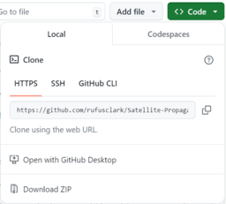

# Satellite Propagation Toolkit

The satellite propagation toolkit is designed to generate 2D projection images and data of trackable objects orbiting Earth using real satellite tracking data from CelesTrak and accurate propagation using the SGP4 model.

The project can generate images based on the tracking data of satellites and satellite tags from the NORAD and SATCAT CelesTrak datasets using either a Topocentric or Geocentric projection above a given location on the Earth's surface.

The project is suitable for everyone from novices with little to no programming experience who want to show what satellites they can see, to experts looking to analyse the satellite orbits, create outreach activities or highlight key space trends.

## Table of Contents

* [Features](#features)
* [Setup](#setup)
* [About the tool](#about-the-tool)
* [Testing](#testing)
* [Generating standalone images and videos](#generating-standalone-images)
* [Outreach recommendations](#outreach-recommendations)
* [Hardware operations](#hardware-operations)
* [Sample analysis](#sample-analysis)
* [Augmented and Virtual Reality](#augmented-and-virtual-reality)
* [Documentation](#documentation)

## Features

The core features of the project are:

* Automatically downloads, caches and updates satellite tracking data and metadata from [CelesTrak](https://celestrak.org/)
* Propagating tracked objects using the industry standard SPG4 model
* Generating 2D data frames containing Topocentric or Geocentric projections of tracked objects over a given position
* Generating images and videos from tracking data based on custom analysis of metadata and satellite tags
* Displaying generated images on [supported devices](#hardware-operations) whilst tethered to a PC or standalone


<!-- Include images of hardware - massive panel -->

This program has been written with extensibility in mind and supports a wide range of customisation without writing any new logic. See [documentation](#documentation) and [quickstart script](examples/quickstart.py) for more details.

## Setup

Instructions for minimal software setup.

See [hardware setup](#hardware-setup) after software setup to set up hardware as well.

### Prerequisites

This project requires that you already have the following software installed on your machine:

* python3.9+
* pip

If you do not meet these requirements, please see this tutorial for installing them, 

### Downloading

To download the project, navigate to the top of this page. Press the "Code" button and then "Download ZIP".



Once you've got your zip file, extract it into your new project folder.

### Installing packages

All the required packages can be installed with the following command in your terminal from the project root directory:

```cmd
pip install -r requirements.txt
```

### Generating an image

Once you've completed the setup you can then generate your first live image of the satellites above your head with the [quickstart script](examples/quickstart.py). This also contains lots of comments to explain the process of generating an image and how you might customise it. This can be executed as follows and will also output contextual information about the image generated:

```cmd
python3 ./examples/quickstart.py
```

> Please note this may take up to a few minutes depending on your internet connection the first time as all the satellite data needs to be downloaded from the internet

## About the tool

This tool works in several discrete steps allowing each part to be reused or extended. The program flow for generating an image works as follows:

1. Load satellite data (or download if not cached or expired)
2. Define and set your matrix size and projection
3. Propogate the satellites and position them on a grid of defined size
4. Render the satellite positions using pre-defined modifiers to create images
5. Save the image

### Data and Propagation

All data used by this tool is downloaded from public API's at [CelesTrak](https://celestrak.org/). This site also includes lots of detail about how the data is generated and what it means.

This data is then used with the industry standard [SGP4 model](https://en.wikipedia.org/wiki/Simplified_perturbations_models) to calculate the location of the satellites.

### Projection Modes

This tool supports 2 projection modes:

1. Topocentric Projection
    * Origin at the observer and about the observer
    * Each pixel represents a given number of degrees N/S or E/W from the observer’s point of view
2. Geocentric Projection
    * Origin at the Earth’s centre and about the observer
    * Each pixel represents a given number of degrees in latitude or longitude (effectively from the centre of the Earth's point of view)

> For specific information about the projection mode, call the `.info()` method on defined models and print the results.

## Testing

The accuracy of the propagations and the generated images have been verified against reliable 3rd party sources and proof-checked by those with a relevant university-level understanding of orbit mechanics.

## Generating standalone images and videos

This project supports generating standalone images, please see [Generating an image](#generating-an-image) for instructions and examples of generating images.

Once you've craeted your `ImageFrame` object (represents a rendered image) you can call the following methods to receive printable data about the image. The following examples is from within the Python interactive environment `python -i ./examples/quickstart.py`:

```python
...
>>> print(image_frame.key())
Key
  red (+255)green (+255)blue (+255) always
>>>
>>>
>>> print(image_frame.key_with_analysis())
Key (total sats = 106)
  red (+255)green (+255)blue (+255) always (sats = 106)
>>>
>>>
>>> print(image_frame.info())
Key (total sats = 106)
  red (+255)green (+255)blue (+255) always (sats = 106)
Sat Frame (sats: 106)
  propagation time: 2024-08-09 22:38:58
  matrix size: (128 x 128)
Topocentric Projection
  observer: 52.40°N, 0.73°W
  cell width: 0.75°N/S, 0.75°E/W
  minimum FoV: 95.75°
  equivalent FoV: 120.00°

ARKTIKA-M 2  (launched 2023-12-16, 237 days ago)
  days since epoch: 6.61
  tags: weather, weather & earth resources, active, special-interest, payload, operational, tyuratam missile and space center, kazakhstan(also known as baikonur cosmodrome)
  grid position: (79, 73)
  altitude: 33260km
  distance from observer: 33405km
BEIDOU-2 M1  (launched 2007-04-13, 6328 days ago)
  days since epoch: 5.24
  tags: satnogs, communications, payload, nonoperational, xichang launch facility, prc
  grid position: (5, 82)
  altitude: 22467km
  distance from observer: 24034km
...
```

For more adavanced analysis this can be used to categorise the number of different satellites in a given projeciton. The key methods are available without rendering an Image using the `Modifiers.key_with_analysis(sat_frame)` method.

Videos can be generated via the `generate_video() function`:
```python
generate_video(
    model=model,
    modifiers=modifiers,
    start_time=datetime(2025, 7, 17, 13, 0),
    video_duration_secs=120,
    propogation_duration_secs=3600,
    fps=10,
    name="Quickstart_video",
    _pixel_width_per_object=5)
```

> Please note the size of satellite dots can be increased using the `_pixel_width_per_object` parameter

## Outreach recommendations

If the goal of this project is to create an outreach device, the following hardware is recommended: The schematics for a 3D printable case are also available for download.

This device will required the following skills and relevent basic equipment to make:

* Soldering (to solder the headers to the Pico board)
* FDM 3D Printing (to make the case)


### Recommended outreach hardware

| Item | Estimated Cost |
| --- | --- |
| [Lipo Pico 16MB](https://shop.pimoroni.com/products/pimoroni-pico-lipo?variant=39335427080275) | £13.50 |
| [Pico Stacking Header Pack](https://shop.pimoroni.com/products/pico-stacking-headers?variant=3927265768251) | £1.50 |
| [Pimoroni 2.8" Display Pack](https://shop.pimoroni.com/products/pico-display-pack-2-8?variant=42047194005587) | £18.90 |
| [2000mAh Battery](https://shop.pimoroni.com/products/lipo-battery-pack?variant=20429082247) | £13.50 |
| Filament 80g | £1.68 |
| Total Cost | £49.08 |

### 3D printable case

A simple case that fits together around the recommended hardware can be printed in PLA, PETG or TPU with a standard desktop FDM 3D printer. This will keep your device safe from drops and mishandling.

Once manufactured the case snaps together with a little force, and can be seperated by pulling the top section to the side with a little force.

I recommend the following print settings:

* Infill Percentage: 15%
* Suppport: None
* Resolution: 0.2mm

File download:

<!-- Slighly alter CAD to ensure better fit and not breaky things :) -->
<!-- Expand around openings, dipslay pack 2.8, adapter leads, port -->
<!-- Reduce overhand and increase ammount of material for bendy bit, increase bendy arm -->

* [Outreach Case Top](./3d%20files/Outreach%20Case%20Top.STL)
* [Outreach Case Bottom](./3d%20files/Outreach%20Case%20Bottom.STL)

### Usage

This outreach device has the same behaviour as defined below in [Hardware operations](#hardware-operations) except this specific Pico board has a power button on to turn it on and off located next to the BOOT button on the Pico board.

## Hardware operations

The project has support for integrating generated images with a variety of devices for tethered and untethered (standalone) operations.

### Supported devices

Tethered mode is designed to work with any device that can send and receive from a serial connection. Untethered mode is designed to be used with devices that support the PicoGraphics library (such as Pinoromi devices).

The following devices are currently supported and have been tested:

* [Pimoroni Pico Unicorn Pack](https://shop.pimoroni.com/products/pico-unicorn-pack?variant=32369501306963)
* [Pimoroni Pico Display Pack](https://shop.pimoroni.com/products/pico-display-pack?variant=32368664215635)
* [Pimoroni Stellar Unicorn](https://shop.pimoroni.com/products/space-unicorns?variant=40842632953939)
* [Pimoroni Pico Display Pack 2.8"](https://shop.pimoroni.com/products/pico-display-pack-2-8?variant=42047194005587)

When using this framework with a supported MicroPython-based device, 2 operation modes are available to drive the display on the hardware device as outlined below.

By default, supported devices will be in tethered mode, but will switch to untethered mode if they have received no commands from the PC in 5 seconds. If no input is detected for 5 minutes in untethered mode, the device will pause, until a button is pressed or a tethered command is received.

### Hardware setup

If you are using one of the supported devices, you can follow these steps to set up your device for the first time.

#### Install the MicroPython firmware

Download the respective firmware for your device from [Pimoroni Firmware](https://github.com/pimoroni/pimoroni-pico/releases) under the assets section.

Insert your device into your computer using a USB cable whilst pressing the BOOTSET button on the back of the Pico board (Please note this button may be in a different place on custom boards, but should have the label BOOT or BOOTSET, if in doubt see youre board's documentation).

Copy the downloaded file onto the Pico storage value on your computer.

#### Install the device software

From this project's root directory, open a terminal and enter python3 interpreter mode.

```cmd
python3 -i
```

Then upload the client code and backup data onto the device using the following commands. Change INSERT-DEVICE-NAME to the name of your device using below:

* `unicornpack`
* `displaypack`
* `stellarunicorn`
* `displaypack2.8`

```python
>>> from src.utility import factory_reset_device
>>> factory_reset_device("INSERT-DEVICE-NAME")
```

If you encounter an issue, please make sure this is the only USB device connected to your computer and reinsert the device.

You can exit python interactive mode with the following command.

```python
>>> quit()
```

### Tethered mode

With tethered mode, the output for the display is generated live on the attached device and sent via serial to the Pico.

Please see [example tethered server script](examples/tethered_server.py) for code examples. Changing variables within this script will change the data output on your board.

This script can be run by entering:

```cmd
python3 ./examples/tethered_server.py
```

If the script freezes and doesn't do anything, please reinsert your device and try again.

You can support additional devices by implementing the following API on your device, where all transmissions are encoded as UTF-8 CSV, as seen below.

> For PicoGraphic-based devices it would be easier to use inherit and overwrite methods for the existing client code [see hardware](src/hardware/) for examples. This will mean your board will also support untethered mode.

```python
# encoding mechanism for commands
cmd = f"{op},{','.join([str(arg) for arg in args])}\n".encode("utf-8")

# set pixel command
cmd = b"1, x, y, R, G, B\n"

# clear display command
cmd = b"2\n"

# get display dimensions
cmd = b"3"
rtn = b"width, height\n"
```

> Please note in tethered mode the Pico acts purely as a display driver and none of the buttons or other hardware are switched on.

### Untethered mode (standalone)

Untethered mode allows the operation of the Pico without a connection to a computer, this works by showing projections uploaded to the Pico in advance with a few fallback modes.

1. Show live pre-computed data (of your area)
2. Show pre-computed data (of your area but another day or time period)
3. Show fallback data of an arbitrary time and day over your current location

This system ensures the Pico will always show data when in untethered mode.

> Please note your device must be battery-powered to work in untethered mode, and time on the device will only be accurate if you have not powered off or restarted the device since it was last connected to a computer and data was uploaded.

#### Using buttons

Within untethered mode clicking a button will automatically change the view. The buttons are always in alphabetical order (i.e. Button A = View 1, Button B = View 2, etc)

#### Uploading data

Please see [example untethered server script](examples/untethered_server.py) for code examples. Changing variables within this script will change the data output on your board.

This script can be run by entering:

```cmd
python3 ./examples/untethered_server.py
```

If the script freezes and doesn't do anything, please reinsert your device and try again.

> Please note this process may take a while, especially on slower devices as the position of satellites in the sky must be calculated for each second.

#### Interpreting the display

If you haven't generated and uploaded any data to the device the backup data will be shown. The display will show the about 50-degree field of view above your head from the location and time the device was set up. This will show the same data for a 60-second loop before resetting.

Using the buttons on your device you can switch between the different data views using the buttons on your device. The 4 buttons on your device respond to the following views in alphabetical order (i.e. view 1 is button A, view 2 is button B, etc)

1. Every satellite is represented by a white dot
2. Satellites are colour-coded based on the launch date
    * Satellites launched before 2000 are red
    * Satellites launched between 2000 and 2020 are green
    * Satellites launched after 2020 are blue
3. Satellites are colour-coded based on their type
    * Communication satellites are red
    * Weather & earth resource satellites are green
    * Navigation satellites are blue
4. Satellites are colour-coded based on altitude
    * Satellites below 1000km are red
    * Satellites between 1000km and 3000km are green
    * Satellites above 3000km are blue

## Sample analysis

Some sample analysis has been included to highlight some key space trends and highlight some of the capabilities of this project.

### Topocentric projections

The following topocentric projections have been generated with an effective FoV of 500 degrees (essentially showing everything in the sky) about 0N, 0E. This gives a really interesting perspective as if you were looking out into space from a point on the equator (except you can see through the Earth).

#### By classification

Key (total sats = 10706):

* Red = Communications (sats = 8678)
* Green = Weather & Earth Resource (sats = 534)
* Blue = Navigation (sats = 193)

Please note this does not include satellites not included in the above 3 categories.

The majority of satellites here are communication satellites. This trend is likely to continue as companies such as SpaceX and OneWeb are looking to commercialise space for personal communication.


#### By debris

Key (total sats = 10706):

* Red = Debris (sats = 0)
* Green = Rocket Body (sats = 24)
* Blue = Other (sats = 10672)

This image shows that not very many of the trackable objects are debris and rocket bodies, it is important to note this is largely on account of the dataset not including this data. Especially in the case of smaller debris pieces such as paint flecks (still massive enough to cause damage to spacecrafts at orbit speeds), which due to their smaller radar cross-section, are much harder to track and pose an invisible hazard that can strike at any time, resulting in more debris and a dangerous feedback loop.


#### By altitude

Key (total sats = 10706):

* Red = 0km to 1000km (sats = 8759)
* Green = 1000km to 3000km (sats = 885)
* Blue = 3000km+ (1052)

Viewing the satellites by altitude shows a few key trends that agree with common orbit types, in which most of the satellites at higher orbits (blue) are around the equator in GEO. But this only makes up a small number of satellites due to the large FoV of satellites at this altitude. The majority of satellites are based below 1000km in LEO, which is a relatively new trend brought about by the growth of small sats and more affordable launch vehicles.

Looking very carefully you can also see constellations in green over the observer's regular repeating pattern in polar orbits.


#### By launch age

Key (total sats = 10706):

* Red = Launched before 2000 (sats = 409)
* Green = Launched between 2000 and 2020 (sats = 1601)
* Blue = Launched after 2020 (sats = 8271)

This image shows that the majority of the satellites were launched in the last 4 years, showing a massive growth in the number of satellites in orbit. Another feature is that most of the satellites in GEO were launched between 2000 and 2020, which may show that this orbit is in popular demand and there is no more space for spacecrafts in GEO-protected orbits.


#### By mega-constellation

Key (total sats = 10706):

* Red = Starlink (sats = 6284)
* Green = OneWeb (sats = 631)
* Blue = Other (sats = 3791)

The majority of the satellites currently in orbit are made up of the two largest constellations, Starlink and OneWeb. You can see the 2 constellations have different orbit patterns, as Starlink has most of the satellites with a 53-degree inclination targeting the growth markets in the areas of the developed world.


### Geocentric projections

The following geocentric projections have been generated with an effective FoV of 280 degrees about the center of the Earth and above 0N, 0E. Each row or column of pixels represents an increase in the latitude or longitude respectively. This is effectively a Mercator projection for satellites.


#### By classification

Key (total sats = 5304):

* Red = Communications (sats = 4315)
* Green = Weather & Earth Resource (sats = 254)
* Blue = Navigation (sats = 85)


#### By debris

Key (total sats = 5304):

* Red = Debris (sats = 0)
* Green = Rocket Body (sats = 14)
* Blue = Other (sats = 5285)


#### By altitude

Key (total sats = 5304):

* Red = 0km to 1000km (sats = 4319)
* Green = 1000km to 3000km (sats = 446)
* Blue = 3000km+ (sats = 536)


#### By launch age

Key (total sats = 5304):

* Red = Launched before 2000 (sats = 220)
* Green = Launched between 2000 and 2020 (sats = 797)
* Blue = Launched after 2020 (sats = 4099)


#### By mega-constellation

Key (total sats = 5304):

* Red = Starlink (sats = 3085)
* Green = OneWeb (sats = 319)
* Blue = Other (sats = 1990)


## Augmented and Virtual Reality

A related project to develop an AR/VR app using Unity to visualise satellites is currently under development. See [Unity README](unity/README.md) for further details.

## Documentation

Please note this project makes extensive use of type hints and docstrings to document and type check the codebase. It is recommended that you use these, within a modern IDE like VSCode with type hinting, as documentation, if you intend to develop or extend this project.

MicroPython stubs are available [here](https://github.com/pimoroni/pimoroni-pico-stubs) but please be wary of changing core embedded code as the MicroPython source code varies from release to release and is inconsistently documented.

### Future Improvement

This section briefly mentions some of the future improvements to this project that I was not possible to implement due to time contrainst around my internship. For most of the below the core code is in place to support there implementation without reformatting.

* Support displaying potential future satellites (and/or mega-constellations) by importing own or generating your own tracking data
* Further optimise code by supporting multiproccessing when sequencially generating images for devices or otherwise
* Support reuse of generated images uploaded to Pico devices. Particularly useful for more quickly uploading custom data to a large number of devices
